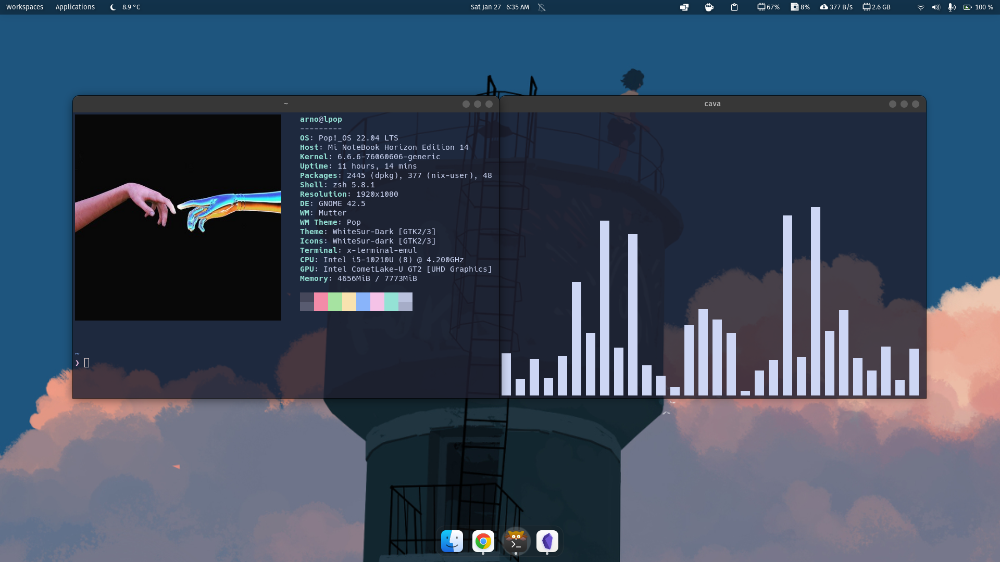
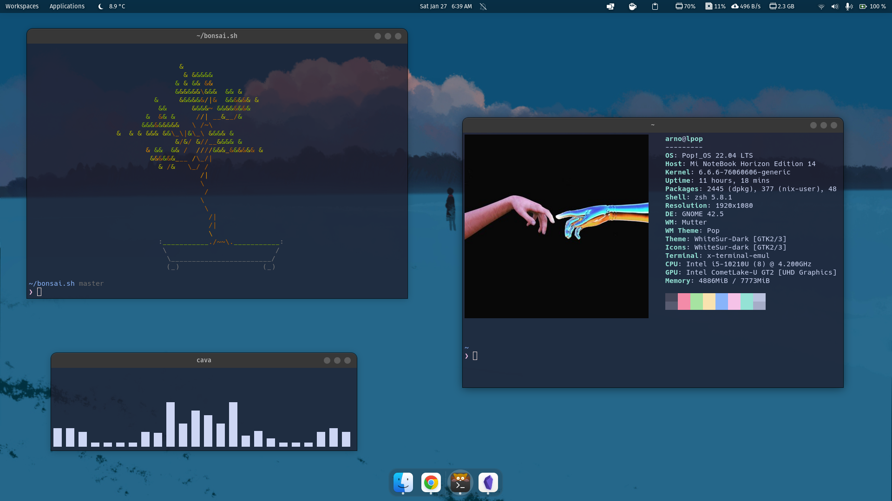

# Pop!_OS Personal Setup Repository 🚀

This repository documents my customized Pop!_OS environment, showcasing the configurations, scripts, and optimizations I've implemented for my workflow and preferences. If you're interested in a curated Pop!_OS setup or seeking inspiration for your own, feel free to explore the details within. Your feedback and suggestions are appreciated.

## 🖼️ Screenshots






## 🔧 Install Essential Packages

```zsh
sudo apt update && \
sudo apt install -y software-properties-common apt-transport-https ca-certificates wget curl gnupg git nala vlc htop deluge wireguard neofetch gimp firefox fontconfig
```
### 🌐 Install Google Chrome
*https://www.google.com/intl/fr_fr/chrome/*

- To download and install Chrome, follow these steps: 

```bash
sudo apt update
sudo apt install wget
wget https://dl.google.com/linux/direct/google-chrome-stable_current_amd64.deb
sudo dpkg -i google-chrome-stable_current_amd64.deb
rm google-chrome-stable_current_amd64.deb
sudo apt install -f
```

- Setup my account for syncing and login to password manager.
### 🎧 Install Discord
https://discord.com/download

```zsh
sudo apt update
wget -O discord.deb "https://discord.com/api/download?platform=linux&format=deb"
sudo dpkg -i discord.deb
rm discord.deb
sudo apt install -f
```

### 💻 Install VS Code
https://code.visualstudio.com/

```zsh
sudo apt update
wget https://update.code.visualstudio.com/latest/linux-deb-x64/stable -O vscode.deb
sudo dpkg -i vscode.deb
rm vscode.deb
sudo apt-get install -f
```

### 🖥️ Install Termius
https://termius.com/download/linux

```zsh
sudo apt update
wget https://www.termius.com/download/linux/Termius.deb
sudo dpkg -i Termius.deb
rm Termius.deb
sudo apt install -f
```

### 📓 Install Obsidian
https://obsidian.md/download

```zsh
sudo apt update
wget https://github.com/obsidianmd/obsidian-releases/releases/download/v1.5.3/obsidian_1.5.3_amd64.deb
sudo dpkg -i obsidian_1.5.3_amd64.deb
rm obsidian_1.5.3_amd64.deb
sudo apt install -f
```

### 📹 Install OBS Studio
https://obsproject.com/kb/linux-installation

```zsh
sudo add-apt-repository ppa:obsproject/obs-studio
sudo apt update && sudo apt install obs-studio -y
```

### 🎵 Install Spotify
https://www.spotify.com/de-en/download/linux/

```zsh
curl -sS https://download.spotify.com/debian/pubkey_6224F9941A8AA6D1.gpg | sudo gpg --dearmor --yes -o /etc/apt/trusted.gpg.d/spotify.gpg
echo "deb http://repository.spotify.com stable non-free" | sudo tee /etc/apt/sources.list.d/spotify.list

sudo apt-get update && sudo apt-get install spotify-client
```
## 📜 Install Nerd-Fonts
https://www.nerdfonts.com/

```zsh
wget https://github.com/ryanoasis/nerd-fonts/releases/download/v3.1.1/Hack.zip
mkdir -p ~/.local/share/fonts/nerd-fonts
unzip Hack.zip -d ~/.local/share/fonts/nerd-fonts
rm Hack.zip
fc-cache -f -v
```

## 🐚 Install ZSH and setup to be default shell
*https://www.zsh.org/*

```bash
sudo apt install zsh
zsh --version
chsh -s $(which zsh)
```

- Logout to apply changes of default shell.
- Choose option to empty .zshrc as ohmyzsh will replace it.
- Check installation with `$SHELL --version`

## ⚙️ Install Ohmyzsh
*https://github.com/ohmyzsh/ohmyzsh/*

```zsh
sh -c "$(curl -fsSL https://raw.githubusercontent.com/ohmyzsh/ohmyzsh/master/tools/install.sh)"
```

### 🚀 Install Zsh autosuggestion and Zsh syntax highlighting
*https://github.com/zsh-users/zsh-autosuggestions/blob/master/INSTALL.md#oh-my-zsh*
*https://github.com/zsh-users/zsh-syntax-highlighting/blob/master/INSTALL.md*

```zsh
git clone https://github.com/zsh-users/zsh-autosuggestions ${ZSH_CUSTOM:-~/.oh-my-zsh/custom}/plugins/zsh-autosuggestions

git clone https://github.com/zsh-users/zsh-syntax-highlighting.git ${ZSH_CUSTOM:-~/.oh-my-zsh/custom}/plugins/zsh-syntax-highlighting
```

- Add the plugin to the list of plugins for Oh My Zsh to load (inside `~/.zshrc`):

```zsh
plugins=(
# other plugins...
git
sudo
copybuffer
copypath
dirhistory
web-search
zsh-autosuggestions
zsh-syntax-highlighting
)
```

## 🔍 Installing fzf
https://github.com/junegunn/fzf

- Using `git`:

```zsh
git clone --depth 1 https://github.com/junegunn/fzf.git ~/.fzf
~/.fzf/install
```

## 🤬 Install thefuck
https://github.com/nvbn/thefuck

- Using `pip`:

```zsh
sudo apt update
sudo apt install python3-dev python3-pip python3-setuptools
sudo pip3 install thefuck
```

- Add this in `$HOME/.zshrc`:

```zsh
eval $(thefuck --alias)
```

## 🔄 Install aliases

- Add `.aliases` in `$HOME` (`touch $HOME/.aliases`)
- Include it in `$HOME/.zshrc` with `source $HOME/.aliases`
> Note: `.aliases` and other configs can be found in [smazmi/dotfiles]

## 📦 Install Node version manager
*https://github.com/tj/n*

```zsh
curl -o- https://raw.githubusercontent.com/nvm-sh/nvm/v0.39.7/install.sh | bash
```

## 🦀 Install Rustup
*https://rustup.rs/*

```zsh
curl --proto '=https' --tlsv1.2 -sSf https://sh.rustup.rs | sh
```
- Add `$HOME/.cargo/bin` in `$PATH`

## 😺 Install Kitty
*https://sw.kovidgoyal.net/kitty/*

### Installation

```zsh
sudo apt install kitty -y
```

### 🔄🐱 Change the default terminal to Kitty

```zsh
sudo update-alternatives --config x-terminal-emulator
```

- After that, all the available terminals on your system will be listed along with a Selection number. What we have to do is type the **selection** number of **Kitty and** hit the **Enter key.**

### 🔧🐱 Install configuration of Kitty

- Place [kitty.conf] from my dotfiles repository in `$HOME/.config/kitty`

### 🎨🐱 Install Kitty theme
#### 🌌🎨🐱 Catppuccin theme for Kitty
https://github.com/catppuccin/kitty

```zsh
git clone https://github.com/catppuccin/kitty
cd kitty/
cp themes $HOME/.config/kitty/
```

- Now you can use the themes kitten to select your desired flavor:

```
kitty +kitten themes --reload-in=all <optional: theme name>
```
`Catppuccin-Latte`, `Catppuccin-Frappe`, `Catppuccin-Macchiato`, `Catppuccin-Mocha` are their respective names.

### 🤓 Changing the default terminal font to nerd-fonts

- Edit this in `~/.config/kitty/kitty.conf`:
```zsh
[...]
font_family      Hack Nerd Font Regular
bold_font        Hack Nerd Font Bold
italic_font      Hack Nerd Font Italic
bold_italic_font Hack Nerd Font Bold Italic
```
> Note: or you can copy `kitty.conf` form [smazmi/dotfiles]

## ⚙️🔧 Install Pure (Prompt)
*https://github.com/sindresorhus/pure*

```zsh
cd $HOME
git clone https://github.com/sindresorhus/pure.git .pure
```

- Add the path of the cloned repo(`$HOME/.pure`) to `$fpath` in `$HOME/.zshrc`.

```
# .zshrc
fpath+=($HOME/.pure)
```

- Initialize the prompt system and choose `pure`:

```
#.zshrc
autoload -U promptinit; promptinit
prompt pure
```

## 🐳 Install Docker

```zsh
sudo apt install docker.io
sudo apt install docker-compose
```

##   🛠️🧙 Install GNOME tweak tools

```zsh
sudo apt install gnome-tweaks
```

### 🧩🧙 Install GNOME extensions

> Note: Install gnome-extensions in browser if not already installed.

- [User Themes](https://extensions.gnome.org/extension/19/user-themes/)
- [Application Volume Mixer](https://extensions.gnome.org/extension/3499/application-volume-mixer/)
- [Blur my Shell](https://extensions.gnome.org/extension/3193/blur-my-shell/)
- [Caffeine](https://extensions.gnome.org/extension/517/caffeine/)
- [Clipboard Indicator](https://extensions.gnome.org/extension/779/clipboard-indicator/)
- [Compiz alike magic lamp effect](https://extensions.gnome.org/extension/3740/compiz-alike-magic-lamp-effect/)
- [Compiz windows effect](https://extensions.gnome.org/extension/3210/compiz-windows-effect/)
- [Coverflow Alt-Tab](https://extensions.gnome.org/extension/97/coverflow-alt-tab/)
- [Dash to Dock for COSMIC](https://extensions.gnome.org/extension/5004/dash-to-dock-for-cosmic/)
- [Gradient Top Bar](https://extensions.gnome.org/extension/4955/gradient-top-bar/)
- [GSConnect](https://extensions.gnome.org/extension/1319/gsconnect/)
- [OpenWeather](https://extensions.gnome.org/extension/750/openweather/)
- [Sound Input & Output Device Chooser](https://extensions.gnome.org/extension/906/sound-output-device-chooser/)
- [Vitals](https://extensions.gnome.org/extension/1460/vitals/)

### 🌈🧙 Install GNOME themes

- Creating `.themes` and `.icons` folder in the `$HOME` directory:

```zsh
mkdir ~/.themes
mkdir ~/.icons
```

#### 🌈 Theme
- Run `git clone https://github.com/vinceliuice/WhiteSur-gtk-theme.git --depth=1`.
- Run `./install.sh -c Dark`.
#### 👾 Icons
- Run `git clone https://github.com/vinceliuice/WhiteSur-icon-theme?tab=readme-ov-file`.
- Run `./install.sh`.
> Use the gnome-tweak-tool to enable GNOME shell theme.

## 📦⚙️ Git config

```zsh
git clone https://github.com/your-username/setup-script.git
cd setup-script
```

- Run the script:
```zsh
chmod +x setup.sh
./setup.sh
```

## 𓅦 QEMU/KVM setup with virt-manager

### 🔮🧩 Check Virtualization Extension
- Run this command to make sure you've enabled virtualization in on your computer. It should be above 0.
```zsh
egrep -c '(vmx|svm)' /proc/cpuinfo
```
- If the output is zero then go to bios settings and enable VT-x (Virtualization Technology Extension) for Intel processor and AMD-V for AMD processor.

### 𓅦⚙️ Install QEMU and Virtual Machine Manager
- Run this:
```zsh
sudo apt install qemu-kvm qemu-system qemu-utils python3 python3-pip libvirt-clients libvirt-daemon-system bridge-utils virtinst libvirt-daemon virt-manager -y
```
- Verify that Libvirtd service is started:
```zsh
sudo systemctl status libvirtd.service
```

### 📶 Start Default Network for Networking
VIRSH is a command to directly interact with our VMs from terminal. We use it to list networks, vm-status and various other tools when we need to make tweaks. Here is how we start the default and make it auto-start after reboot.

1. To start Network default:
```zsh
sudo virsh net-start default
```
2. To mark Network default as autostart:
```zsh
sudo virsh net-autostart default
```
3. To check it's status:
```zsh
sudo virsh net-list --all
```
- The output should be:
```
 Name      State      Autostart   Persistent
----------------------------------------------
 default   active       yes          yes
```

### 👤 Add User to libvirt to Allow Access to VMs
```zsh
sudo usermod -aG libvirt $USER
sudo usermod -aG libvirt-qemu $USER
sudo usermod -aG kvm $USER
sudo usermod -aG input $USER
sudo usermod -aG disk $USER
```
- Reboot `sudo reboot now`.

## 📦 Install Nix package manager
https://nixos.org/download#nix-install-linux

1. Run the following script:
```zsh
sh <(curl -L https://nixos.org/nix/install) --daemon
```
 2. Add the following to the config file:
 ```zsh
 # vim .config/nix/nix.conf
 experimental-features = nix-command flakes
```

## 📦 Install Flatpak
https://flatpak.org/setup/Ubuntu
1. Install Flatpak using apt:
```zsh
sudo apt install flatpak
```
2. Reboot. (`sudo reboot now`).
### 📦📲 Installing Flatpak applications
- Telegram:
```zsh
flatpak install flathub org.telegram.desktop
```
- WhatsApp:
```zsh
flatpak install flathub io.github.mimbrero.WhatsAppDesktop
```
- Stremio:
```zsh
flatpak install flathub com.stremio.Stremio
```

## 👷🏻‍♂️ Building the latest Neovim from source
https://github.com/neovim/neovim/blob/master/BUILD.md

### 🧰 Build prerequisites
- Install the following packages:
```zsh
sudo apt-get install ninja-build gettext cmake unzip curl
```

### 🚦 Quick Start
1. Clone the Neovim repository.
```zsh
git clone https://github.com/neovim/neovim
cd neovim
```
2. Switch your working directory to the latest commit on the "stable" branch.
```zsh
git checkout stable
```
3. Build a DEB-package and install it. This should help ensuring the clean removal of installed files.
```zsh
cd build && cpack -G DEB && sudo dpkg -i nvim-linux64.deb
```

## 🌑 Installing LunarVim
https://www.lunarvim.org/docs/installation

### 🧰 Prerequisites
- Install `node`:
```zsh
nvm install node
```
- Install `pip`:
```zsh
sudo apt install python3-pip -y
```
- Install `lazygit`:
```zsh
LAZYGIT_VERSION=$(curl -s "https://api.github.com/repos/jesseduffield/lazygit/releases/latest" | grep -Po '"tag_name": "v\K[^"]*')
curl -Lo lazygit.tar.gz "https://github.com/jesseduffield/lazygit/releases/latest/download/lazygit_${LAZYGIT_VERSION}_Linux_x86_64.tar.gz"
tar xf lazygit.tar.gz lazygit
sudo install lazygit /usr/local/bin
```
```zsh
lazygit --version
```

### ⚙️ Installation

```zsh
LV_BRANCH='release-1.3/neovim-0.9' bash <(curl -s https://raw.githubusercontent.com/LunarVim/LunarVim/release-1.3/neovim-0.9/utils/installer/install.sh)
```

## ⌨️ Keyboard Shortcuts

### 🎼 Spotify
These shortcuts will trigger action only in Spotify! If you want it to be global just set it in 
`Settings > Keyboard > Keyboard Shortcuts > Sound and Media`

- In `Setting > Keyboard > Keyboard Shortcuts > Custom Shortcuts`
- Add following

```zsh
# Super+8
dbus-send --print-reply --dest=org.mpris.MediaPlayer2.spotify /org/mpris/MediaPlayer2 org.mpris.MediaPlayer2.Player.PlayPause

# Super+7 
dbus-send --print-reply --dest=org.mpris.MediaPlayer2.spotify /org/mpris/MediaPlayer2 org.mpris.MediaPlayer2.Player.Previous

# Super+9
dbus-send --print-reply --dest=org.mpris.MediaPlayer2.spotify /org/mpris/MediaPlayer2 org.mpris.MediaPlayer2.Player.Next
```

### 🚀 Launcher
- Some personal shortcuts for the launcher

```
## Launchers
# Super+E
Launch Home folder

## Navigation
# Alt+D
Hide all normal windows

## Windows
# Alt+S
Hide window
```

## 🔩 Configurations

1. Use [smazmi/dotfiles] to (re)configure machines. `.zshrc`, `.bashrc` etc.
2. Clone [smazmi/scripts] for a collection of automation scripts.
3. Clone [smazmi/wallpapers] for cool wallpapers.

## Yesssss! 👊❤️

"Have fun using your completely configured system, future me." - Old you.
